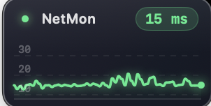
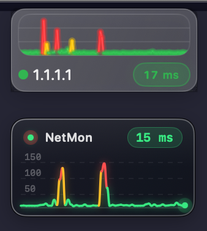
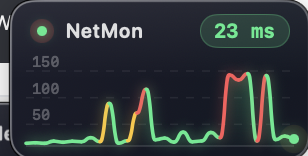

# NetMon

A minimal macOS network monitor widget that lives in the top-right corner of your screen.


## More Screenshots


*Expanded widget with dual-series network graph, axis labels, and compact metric badges.*


*Regular-size widget showing latency foreground and mirrored bytes traffic series.*


*Minimized mode (title bar only) with live latency and traffic badges.*

## Features

- **Real-time ICMP ping** — pings Cloudflare (`1.1.1.1`) every 1 second using standard 56-byte packets
- **Live dual graph**:
  - latency (foreground) with segment-based color transitions
  - traffic bytes down/up (background) in mirrored blue series around a center baseline
  - smooth scrolling, interpolation and clipping at both edges
  - clean chart area (no dashed grid overlay)
  - packet loss samples drop to `0` and are highlighted in **red**
- **Dual Y-axes**:
  - left axis for latency (10-step labeling, adaptive density)
  - right axis for bytes (adaptive labels and spacing for small sizes)
- **Glass design** — semi-transparent widget with lightweight border
- **Tint/Blur presets** — 5 levels from `Very Light` to `Very Dark`, persisted across restarts
- **Window state persistence** — remembers size and position across restarts
- **Always on top toggle** — can be changed at runtime from context menu
- **Area-aware double-click interactions**:
  - title bar: `Minimize` / `Full`
  - graph area: `Expand (x4)` / `Restore Size`
  - right-click anywhere for context menu
- **Context menu controls**:
  - Always on Top
  - Minimize / Full
  - Expand (x4) / Restore Size
  - Reset View
  - Tint/Blur
  - Show/Hide Latency Graph
  - Show/Hide Traffic Graph
- **Keyboard shortcuts**:
  - `Cmd+E` Expand / Restore Size
  - `Cmd+M` Minimize / Full
  - `Cmd+R` Reset View
- **Loss badge behavior**:
  - Latency box shows red `∞` during packet loss
- No Dock icon, no menu bar clutter

## Requirements

- macOS 14 (Sonoma) or later
- Xcode Command Line Tools (`xcode-select --install`)

## Build & Run

```bash
git clone https://github.com/magnuslenngren/netmon
cd netmon
swift build
cp .build/debug/NetMon NetMon.app/Contents/MacOS/NetMon
ditto NetMon.app /Applications/NetMon.app
open /Applications/NetMon.app
```

## Install From Release (No Xcode Needed)

1. Download the latest `.dmg` from [GitHub Releases](https://github.com/magnuslenngren/netmon/releases).
2. Open the `.dmg`.
3. Drag `NetMon.app` to `Applications`.
4. Launch from `Applications`.

If macOS shows an unidentified developer warning, use **Right-click -> Open** the first time.

## Fast Run Script

Use the included script to rebuild, install to `/Applications`, and relaunch:

```bash
./run-netmon.sh
```

## Build DMG (Maintainers)

Create a versioned DMG artifact:

```bash
./scripts/build-dmg.sh 1.0.0
```

If no version is provided, it uses `YYYY.MM.DD-<short-sha>`.

## Publish GitHub Release (Maintainers)

Example:

```bash
VERSION=1.0.0
DMG_PATH="$(./scripts/build-dmg.sh "$VERSION")"
gh release create "v$VERSION" "$DMG_PATH" \
  --title "NetMon v$VERSION" \
  --notes "macOS app DMG build"
```

## Auto-launch at Login

Drag `NetMon.app` to **System Settings → General → Login Items**.
